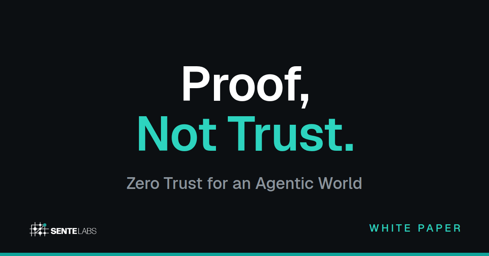

**Why this repo exists.**
An AI agent can be talked into anything by the text it reads — a poisoned web page, a crafted email, a malicious tool description. extensible-mcp assumes exactly that. It loads MCP servers dynamically so your context doesn't carry tools you aren't using, selects tools by retrieval instead of prompt-stuffing, and runs every proposed action through a filter pipeline enforcing Rego policy — plain, deterministic code the model never reads and can never be talked past.
The agent proposes; it never commits.

The full architecture — signed human approvals bound to exact actions, provable policies, why "human in the loop" fails at agent speed — is in the white paper: **[Proof, Not Trust: Zero Trust for an Agentic World](https://sentelabs.ai/proof-not-trust)** — readable in full on the page.

[](https://sentelabs.ai/proof-not-trust)

---

# extensible-mcp

extensible-mcp is a proxy that sits between an LLM and the universe of MCP servers, providing on-demand tool retrieval and a deterministic enforcement point for access control. Tool definitions don't need to live in the prompt, sensitive credentials don't need to live in the LLM's context, and security policies are evaluated by code rather than by the model.

## Why

Connecting an LLM client to a set of MCP servers is normally a startup-time decision: list servers in a config, launch the client, hope you guessed right. There's no clean way to add a server mid-conversation, or to have the LLM itself reach for a capability that wasn't pre-configured.

Even once servers are connected, the LLM client is handed a flat list of every tool from every server, injected wholesale into the context window. As the number of servers grows, this causes token bloat, degraded model performance, and hard context-limit failures — even when most tools aren't relevant to the current turn.

And there's no standard control plane. If you want to block dangerous operations, enforce argument-shape policies, or gate which servers an LLM is allowed to connect to in the first place, you have to build that into each client or each server individually.

The temptation is to push these decisions onto the LLM itself — but anything an LLM sees is both transported across the network on every turn and vulnerable to prompt injection from any document, tool result, or web page it reads. Secrets have to stay out of the model's context, and security cannot be left to LLMs communicating with external systems of any type. Enforcement has to live somewhere deterministic, between the model and the outside world.

extensible-mcp sits between the LLM and your MCP servers and addresses all three:

1. **Dynamic server loading** — Connect to MCP servers at startup from config, or at runtime by URL. The LLM can pull in entirely new servers and their capabilities from across the network on demand, without restarting the client.
2. **RAG-based tool search and retrieval** — Tool definitions are embedded into a vector index. The LLM searches semantically with `search_tools(query)` and pulls back only the matches it needs, instead of every tool definition occupying space in every prompt.
3. **Pluggable filter pipelines** — Every operation (search, call, server load) passes through a filter chain. The proxy enforces one structural guarantee: the LLM can only call tools it has previously surfaced via `search_tools`. Beyond that, the filter logic is yours: ship-with reference filters cover access control, Rego policy evaluation, and server-load whitelisting; bring your own for argument validation, audit logging, signed-claim verification, or anything else.

```
LLM  <-->  extensible-mcp  <-->  MCP Server(s)
              |
              +-- search_tools(query)         → vector search over indexed tools
              +-- call_tool(name, args)        → proxied to the right server
              +-- load_mcp_server(name, url)   → connect a new server at runtime
```

## How It Works

The proxy exposes three meta-tools to the LLM:

- **`search_tools(query)`** — Describe what you want to do in natural language. The proxy embeds the query with [all-MiniLM-L6-v2](https://huggingface.co/sentence-transformers/all-MiniLM-L6-v2), runs cosine similarity against the tool index, and returns matching definitions.
- **`call_tool(tool_name, arguments)`** — Invoke a tool by its qualified name (e.g. `github__create_issue`). The proxy routes the call to the correct downstream server.
- **`load_mcp_server(server_name, url)`** — Connect to a new remote MCP server at runtime. Its tools are indexed immediately and become available for search and invocation.

Retrieval is model-driven: the LLM decides when to search and crafts its own queries, so there's no wasted retrieval on turns where no tools are needed.

## Status

v1 of the proxy is working: dynamic server loading, RAG-based tool retrieval, an extensible filter pipeline, and credential handling all ship today. The pipeline enforces one structural guarantee — the LLM can only call tools it has discovered via `search_tools` — and ships reference filters for access control, Rego policy evaluation, and server-load whitelisting that you can use as-is, configure, or replace with your own. 104 tests pass; the example configs work against the official GitHub MCP server.

The pipeline is policy-engine-agnostic: Rego is hooked into the call filter today as a reference, but the architecture doesn't privilege any single engine — drop in OPA, Cedar, custom Python, or whatever fits your stack. Active research directions:

- **Signed-claim verification** at call time — push approvals, signed documents, Verifiable Credentials. See the threat-model section for the argument.
- **Native Policy-as-Type integration** — linking to the framework from [Policy as Code, Policy as Type (Fuchs, 2025)](https://arxiv.org/abs/2506.01446), which treats policies as dependent types. Properties of the policy can be mathematically proven rather than just tested.

Both directions extend the existing filter pipeline without architectural change.

## Threat Model

LLMs cannot be trusted to manage their own security. They are open to prompt injection attacks from any material they ingest, they can be influenced by material in their training set in non-obvious ways, including treating data as instructions, they hallucinate, they can forget instructions, and any information passed to them must be considered compromised. Therefore any serious attempt to enforce rules must live outside the LLM in code not subject to all these weaknesses. That is our premise.

The pipeline allows for control at all points of contact between the LLM and the external world:

- At server loading time, we can filter and prohibit the agent from loading untrusted servers. Beyond just the tools, the server and tool descriptions can contain prompt injection attacks.
- At search time, we can, again, hide dangerous or untrusted tools. In the current release, we include a sample filter to hide any tool containing "delete"; not only can't such a tool be called, it can't be found.
- At call time, further policies can prevent illegitimate use of an allowed tool. In the sample code we prevent the closing of an issue, but allow other uses of the same tool to allow updating issues.
- The LLM cannot call any tools it didn't find during search. This ensures the LLM calls only tools in the protected set and is not vulnerable to attempts to call outside the protected envelope.
- We do not pass secrets (in particular, security tokens) to the LLM. Tokens to be used in HTTP Authorization headers are kept in a separate file. The LLM can prompt the user to update a token when it appears to have expired, but it never sees the tokens themselves.

Of course, we can only apply these protections within the context of the LLM itself. We cannot protect against:

- Security flaws in the user's configuration,
- The behavior of downstream servers (although limiting to trusted servers can mitigate that),
- Policies that trust unverified LLM claims (such as whether the user has agreed to some action)
- Otherwise ineffective policies (for example, our simple Rego script prohibits one action, but allows all others).

It's tempting to use required argument values as a way to extend policies, such as requiring `confirmation: 'CONFIRM_DELETE'` before a delete proceeds. We considered this and discarded it: an LLM that can be prompt-injected into deleting a file can also be prompt-injected into supplying the confirmation string. The user's acquiescence is unproven. The mechanism prevents accidents but not adversaries. We will address this pattern using signed claims, evidence whose validity depends on a channel the LLM cannot influence.

This becomes especially acute as agents communicate with other agents. A2A, which AP2 depends on, has the receiving agent process every message through an LLM, making every counterparty message a potential prompt injection vector. An LLM's judgment about what its negotiating partner has agreed to is structurally unsafe; the same signed-evidence architecture that addresses single-agent authorization is even more necessary in multi-agent settings.

By adding support for signed claims as parameters, we can ensure that values come from valid sources, such as the user, and cannot have been forged by the LLM. Examples of this include Duo or CIBA push approvals, W3C Verifiable Credentials (which are used for Google's AP2 and its extension, the Universal Commerce Protocol), or DocuSign-grade envelopes.

With the addition of signed claims, we can inject this level of security in three parts:

- First, before handing a tool definition to the LLM the prefilter modifies the parameter schemas to specify which must be signed.
- These requirements force the LLM to retrieve valid claims for these parameters, either from the user or from other parties. The signing requirement prevents the LLM from spoofing.
- Finally, at tool call time, policies validate the signed parameters as part of approving the call.

This addresses the unverified claims issue and can also be used to strengthen the guarantee that an MCP Server is permitted. Verified claims are now key to agentic commerce, as shown by Google's Universal Commerce Protocol, but the requirement will hold for many non-commercial operations, such as deleting files.

We currently ship Rego hooked into the call filter as a reference policy engine, but the pipeline isn't tied to it — any policy engine can plug in via a custom `CallFilter`. Rego's strength is broad ABAC expressiveness; its weakness is minimal support for type-checking policy correctness (input shapes can be checked with JSON Schema, but the policy logic itself isn't verified). We plan to link to the framework from [Policy as Code, Policy as Type (Fuchs, 2025)](https://arxiv.org/abs/2506.01446), which treats policies as dependent types and lets properties of a policy be mathematically proven rather than just tested.

## Setup

Requires Python 3.11+.

```bash
# Clone and install
git clone https://github.com/mattdfuchs/extensible-mcp.git
cd extensible-mcp
uv sync

# Create a config file
cp config.example.json config.json
# Edit config.json with your MCP servers
```

`config.example.json` is intentionally a minimal starter — see the Configuration section below for the full set of options (URL servers, `rego_policy`, `load_control`, etc.).

If your config references `$VAR_NAME`-style values (e.g. `"GITHUB_PERSONAL_ACCESS_TOKEN": "$GITHUB_PERSONAL_ACCESS_TOKEN"` in a stdio server's `env` block), drop a `.env` file in the same directory as the loaded config or export the variables in your shell — the proxy resolves dotenv first, then `os.environ`. The `.env` lookup is per-config-directory, so a `.env` at the repo root won't apply to configs loaded from elsewhere.

## Configuration

The config file uses the same `mcpServers` format as Claude Desktop, plus an optional `filters` section. Servers can be local (stdio via `command`) or remote (Streamable HTTP via `url`):

```json
{
  "mcpServers": {
    "filesystem": {
      "command": "npx",
      "args": ["-y", "@modelcontextprotocol/server-filesystem", "/tmp"]
    },
    "github": {
      "command": "npx",
      "args": ["-y", "@modelcontextprotocol/server-github"],
      "env": {
        "GITHUB_PERSONAL_ACCESS_TOKEN": "<your-token>"
      }
    },
    "remote-tools": {
      "url": "https://example.com/mcp"
    }
  },
  "filters": {
    "similarity_threshold": 0.3,
    "access_control": {
      "deny": ["github__delete_repo"],
      "deny_patterns": ["*__drop_*", "*__delete_*"],
      "allow_servers": ["filesystem", "github"]
    },
    "load_control": {
      "deny_url_patterns": ["http://*"],
      "allow_url_patterns": ["https://github.com/*", "https://internal.corp/*"]
    }
  }
}
```

### Authentication

Many MCP servers require credentials — OAuth Bearer tokens, PATs, API keys. extensible-mcp supports two paths, depending on how the downstream server is reached:

**Stdio servers** (launched as child processes via `command`) — pass credentials through the `env` block in `mcpServers`, the same way you would for any MCP server. The GitHub example in [`examples/`](examples/) uses this pattern with `$GITHUB_PERSONAL_ACCESS_TOKEN` resolved from a `.env` file or the proxy's environment.

**URL servers** (Streamable HTTP via `url`) — drop a `tokens` file next to your config:

```
# tokens — gitignored by default
notion=secret_xxxxxxxxxxxxxxxxxxxxxxxxxxxxxxxxxxxx
internal-api=eyJhbGciOiJIUzI1NiIs...
```

Format: one `server_name=value` pair per line, `#` for comments, surrounding quotes on values are stripped. The proxy automatically picks up `tokens` if it exists in the same directory as the loaded config.

**Moving the tokens file outside the project.** If your setup includes a filesystem MCP server (or any other tool) that can read paths inside the project directory, the default `tokens` location is reachable by the agent. To keep credentials out of reach, set `EXTENSIBLE_MCP_TOKENS_FILE` to a path the agent can't see — e.g. `~/.secrets/extensible-mcp-tokens`. The variable can be set in the proxy's environment or in the `.env` file next to the config; relative paths are resolved relative to the config directory, and `~` is expanded. If the variable is set but the file doesn't exist, the proxy refuses to start. Without the variable, behavior is unchanged: the proxy looks for `tokens` next to the config and runs without one if it isn't there. The resolved path is logged at startup so you can confirm which file is in use.

Tokens are sent as `Authorization: Bearer <token>` headers. The file is read fresh on every connection, so you can rotate credentials without restarting the proxy — overwrite the line, save, and the next request picks up the new value.

extensible-mcp does **not** run an OAuth flow itself. If a server uses OAuth, mint the access token externally (CLI, browser flow, headless service-account auth, whatever you have) and drop it into the `tokens` file. Refresh is your responsibility.

**Token expiry.** If a downstream call returns 401/403 (or an error message containing "unauthorized"/"forbidden"), the proxy translates it into a clear error to the LLM naming the server and reporting how long the token has been unchanged. The proxy's system instructions tell the LLM to ask the user to update the token in the `tokens` file and retry — never to request a token in the conversation. Tokens stay out of the chat transcript by design.

### Filter pipelines

Three independent pipelines — search, call, and server-load — each pass requests through an ordered chain of filters before the operation runs. The proxy enforces one structural guarantee: **the LLM can only call tools it has previously surfaced via `search_tools`.** That gate is built into the call pipeline and cannot be bypassed.

Beyond the discovery gate, the filter logic is yours to define. The filters described below ship as reference implementations and are configured via the JSON config; for anything beyond them, write your own — see [Writing a custom filter](#writing-a-custom-filter).

**Search filters** — applied to `search_tools` results before they're returned to the LLM.

| Field                          | Description                                                     |
| ------------------------------ | --------------------------------------------------------------- |
| `similarity_threshold`         | Minimum cosine similarity score (default: `0.3`)                |
| `access_control.deny`          | Exact qualified tool names to hide (e.g. `github__delete_repo`) |
| `access_control.deny_patterns` | Glob patterns to hide (e.g. `*__delete_*`)                      |
| `access_control.allow_servers` | If non-empty, only tools from these servers appear in results   |

**Call filters** — applied to `call_tool` invocations before they're proxied downstream.

| Field              | Description                                                                        |
| ------------------ | ---------------------------------------------------------------------------------- |
| `access_control.*` | Same deny/allow rules as search — blocks calls even if the LLM knows the tool name |

**Rego policies** — for fine-grained call-time policy evaluation, you can point to a `.rego` file:

```json
{
  "filters": {
    "rego_policy": "policies/deny_dangerous.rego"
  }
}
```

The policy receives this input on every `call_tool` invocation:

```json
{
  "tool_name": "github__delete_repo",
  "arguments": {"repo": "my-org/my-repo"},
  "server_name": "github"
}
```

The policy must define `allow` (boolean). Optionally define `deny_reason` (string) for a custom error message. See [`examples/deny_dangerous.rego`](examples/deny_dangerous.rego) for a working example. Relative paths in the config are resolved relative to the config file's directory.

Rego policy evaluation uses [`regopy`](https://pypi.org/project/regopy/), which is installed by default with `uv sync` — no extra step needed.

**Server load filters** — applied to `load_mcp_server` requests before any connection is made.

| Field                             | Description                                                                   |
| --------------------------------- | ----------------------------------------------------------------------------- |
| `load_control.deny_names`         | Exact server names to block                                                   |
| `load_control.deny_name_patterns` | Glob patterns on server names (e.g. `evil_*`)                                 |
| `load_control.deny_url_patterns`  | Glob patterns on URLs (e.g. `http://*` to require HTTPS)                      |
| `load_control.allow_url_patterns` | If non-empty, only URLs matching at least one pattern are allowed (whitelist) |

Without `load_control`, an LLM could be prompt-injected into connecting to a malicious server. Use `allow_url_patterns` to whitelist trusted domains and `deny_url_patterns` to block insecure protocols.

### Writing a custom filter

The reference filters described above are starting points, not the limit of what the pipeline can do. Filters are plain Python objects implementing one of three Protocols:

- **`ToolFilter`** — `filter(results: list[SearchResult], query: str) -> list[SearchResult]`. Applied to `search_tools` results.
- **`CallFilter`** — `async check(request: CallRequest) -> CallFilterResult`. Applied to `call_tool` invocations.
- **`ServerLoadFilter`** — `async check(request: ServerLoadRequest) -> ServerLoadResult`. Applied to `load_mcp_server` requests.

A custom call filter that audits every invocation:

```python
from extensible_mcp import CallFilter, CallRequest, CallFilterResult

class AuditLogFilter:
    async def check(self, request: CallRequest) -> CallFilterResult:
        log_to_my_system(request.tool_name, request.arguments, request.server_name)
        return CallFilterResult(
            allowed=True,
            tool_name=request.tool_name,
            arguments=request.arguments,
        )
```

Wire it in by writing your own entry point — `create_server` accepts `extra_search_filters`, `extra_call_filters`, and `extra_load_filters`:

```python
from extensible_mcp.config import find_config_path, load_config
from extensible_mcp.server import create_server
from myorg.filters import AuditLogFilter

config = load_config(find_config_path(None))
server = create_server(config, extra_call_filters=[AuditLogFilter()])
server.run()
```

Custom filters run after the built-in reference filters in each pipeline. To deny a call, return `CallFilterResult(allowed=False, reason="...", tool_name=..., arguments=...)`. The discovered-tools guarantee runs before any custom call filter and is always enforced regardless of your filter set.

### Config resolution order

1. `--config` CLI flag
2. `EXTENSIBLE_MCP_CONFIG` environment variable
3. `~/Library/Application Support/extensible-mcp/config.json` (macOS)
4. `~/.config/extensible-mcp/config.json`
5. `./config.json`

## Usage

```bash
# Run the server
uv run extensible-mcp

# Or with an explicit config path
uv run extensible-mcp --config /path/to/config.json
```

The proxy runs as a stdio-based MCP server. Connect to it from any MCP client the same way you would connect to any other MCP server.

## Examples

The [`examples/`](examples/) directory has ready-to-use configs for proxying GitHub's official MCP server through extensible-mcp, with two layers of security in the filter pipeline: a glob deny pattern (`*__delete_*`) that blocks all delete operations, and a Rego policy that blocks closing issues based on argument shape.

- **Claude Desktop** — [`examples/claude-desktop-config.json`](examples/claude-desktop-config.json)
- **OpenClaw** — [`examples/openclaw-config.json`](examples/openclaw-config.json)

See [`examples/README.md`](examples/README.md) for setup instructions and suggested prompts to try.

## Development

```bash
# Install with dev dependencies
uv sync --group dev

# Run tests
uv run pytest

# Run a single test file
uv run pytest tests/test_filters.py -v
```

## License

Apache License 2.0 — see [LICENSE](LICENSE).
